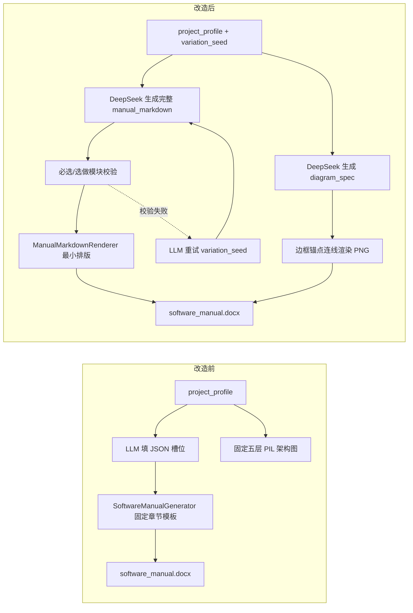

# IPRight 说明书 / 架构图 / 界面设计去模板化改造说明（2026-05-10）

## 1. 背景与根因

改造前存在三类“看起来一样”的问题：

1. **说明书排版雷同**：`SoftwareManualGenerator` 以固定 Word 章节骨架渲染（每个模块固定「功能定位 / 页面构成 / 功能要点 / 典型操作说明…」等三级标题），LLM 仅填充 JSON 槽位，无法改变章节组织与版式。
2. **架构图雷同**：`diagrams.py` 仅在三套 PIL 盒子布局（matrix / ladder / gallery）间切换，且箭头曾连到节点中心；节点标题长期固定为模板文案。
3. **前端页面雷同**：build 阶段在模块页 LLM 校验失败后会调用 `_render_module_page` 本地套板，导致同任务多页结构高度一致。

## 2. 改造后流程（Before → After）

## 3. 固定模块 vs 自由设计边界

| 维度 | 固定保留（软著必需） | 交给 DeepSeek 自由发挥 |
|------|----------------------|-------------------------|
| 章节存在性 | `REQUIRED_MANUAL_MODULES` 10 个必选模块必须出现 | 章节顺序、子标题命名、段落/列表/表格组织 |
| 扩展章节 | 从 `OPTIONAL_MANUAL_MODULES` 选 4~7 个 key | 扩展章节内部写法与信息展开方式 |
| 截图 | 每张截图必须插入并有说明 | 页面说明的段落结构、操作步骤组织 |
| 架构图 | 必须生成 PNG 并插入「系统架构图」 | 布局拓扑、节点命名、连线关系、图注表述 |
| 前端 UI | 中文字体、业务字段、模块标题必须与画像一致 | 导航壳层、配色、组件排布、每页 `page_design_brief` |
| 排版壳层 | 页眉、页脚页码、封面基本信息 | 不再强制统一三级功能标题模板 |

## 4. 关键实现点

- `manual_compose.py`：`build_variation_seed`、必选模块校验、`ManualMarkdownRenderer`（封面副标题 × 封面布局 × 标题编号风格 × 标题层级偏移 × 段落间距，共 5 维度随 seed 变化）。
- `LLMClient.generate_manual_markdown`：user payload 显式携带 `required_manual_modules` / `optional_manual_modules`；`manual_retry_attempt` 驱动重试差异化；prompt 明确要求区分必选模块（全部出现）与选做模块（选 4-7 个），并要求每份说明书的编号体系、标题层级、段落组织方式各不相同。
- `LLMClient.generate_architecture_diagram_spec`：要求连线连接节点边框边缘（非中心），箭头与方框内文字保持间距；`arrow_points_between_boxes` 在渲染时将端点落在矩形边缘。
- `diagrams.py` PIL 回退路径：已修复为同样通过 `arrow_points_between_boxes` 计算边框锚点，不再使用硬编码中心坐标。
- `build_support.py`：`_PAGE_LAYOUT_PATTERNS` 扩充至 18 种页面布局模式，`_PAGE_VISUAL_ACCENTS` 扩充至 12 种视觉风格；hash 切片从 `[:2]`/`[2:4]` 扩展为 `[:4]`/`[4:8]`，减少同一任务内不同页面收敛到相同布局的概率。
- `delivery_support.generate_manual_delivery`：仅 LLM 主路径 + 最多 4 次重试；**已移除** `markdown_fallback`、`template_fallback`、`SoftwareManualGenerator`。
- `build_support.generate_task_app_code`：模块页失败时最多 4 轮 LLM 重试（注入 `page_design_brief`、`module_retry_attempt`）；**已移除** `_apply_module_template_fallback`。

## 5. 配置与注意事项

- 仍使用现有 DeepSeek 客户端与环境变量：`DEEPSEEK_API_KEY` / `LLM_API_KEY`、`DEEPSEEK_API_BASE`、`LLM_MODEL`。
- `project_profile.variation_seed` 由 `task_id + build_id + design_seed` 派生。
- 截图占位符：`[[SCREENSHOT:页面标题]]`、架构图 `[[SCREENSHOT:ARCH]]`。
- 说明书或模块页在重试耗尽后 **compose/build 阶段失败**，不再静默降级到固定模板。

## 6. 验收建议

- 连续创建两个不同行业任务，对比说明书标题顺序、模块页布局、架构图连线与节点排布是否明显不同。
- 检查 `llm_used` 是否为 `deepseek-markdown` / `deepseek-markdown-retry-N` / `deepseek-markdown+diagram`。
- 运行：`pytest backend/tests/test_document.py backend/tests/test_llm.py backend/tests/test_workers.py -x`

### 6.1 已移除的回退路径（2026-05-26）

| 路径 | 原行为 | 现行为 |
|------|--------|--------|
| `_apply_module_template_fallback` | 无效模块页写入 `_render_module_page` 套板 | 已删除；继续 LLM 重试，仍失败则 build 失败 |
| `markdown_fallback` | `build_fallback_manual_markdown` 拼装 Markdown | 已禁用（函数保留供单元测试） |
| `template_fallback` | `SoftwareManualGenerator` 固定 Word 模板 | 已禁用；compose 抛错 |

### 6.2 页面设计与排版差异化增强（2026-05-26）

| 维度 | 改造前 | 改造后 |
|------|--------|--------|
| `_PAGE_LAYOUT_PATTERNS` | 6 种布局模式 | 18 种（新增 kanban、tree-nav、tab-segments、master-detail 等） |
| `_PAGE_VISUAL_ACCENTS` | 5 种视觉风格 | 12 种（新增 rounded-cards、compact-spacing、dark-theme 等） |
| Hash 切片精度 | `[:2]`/`[2:4]`（256 值） | `[:4]`/`[4:8]`（65536/4.3B 值），减少碰撞 |
| 封面版式 | 5 种副标题 × 2 种层级偏移 | 8 种副标题 × 5 种封面布局 × 5 种标题编号风格 |
| 标题编号 | 无 | 新增 decimal / chinese / mixed / alpha 自动编号 |
| 架构图回退路径 | 硬编码中心坐标连线 | 统一通过 `arrow_points_between_boxes` 连接边框边缘 |
| LLM 说明书 prompt | 未显式区分必选/选做模块 | 明确要求必选模块全部出现、选做模块选 4-7 个，每份说明书编号/层级/段落组织必须不同 |
